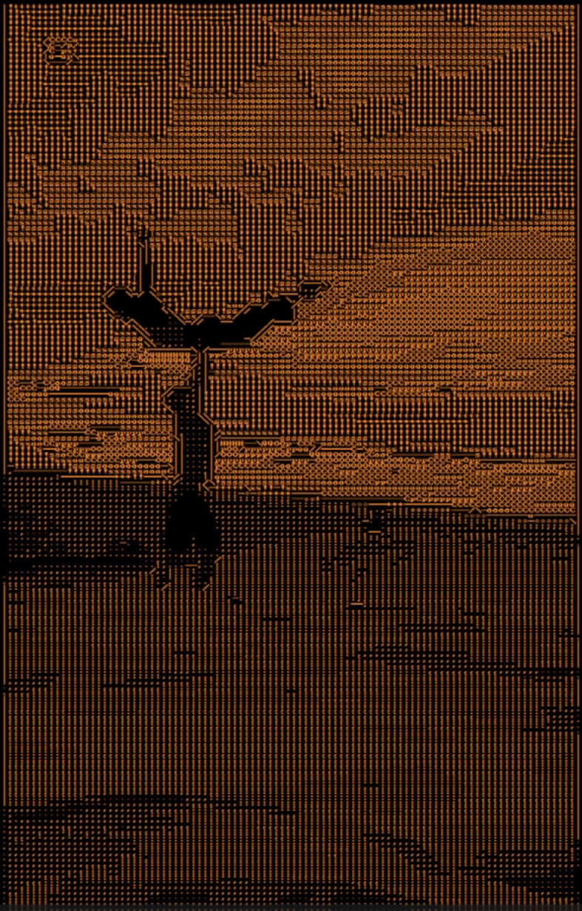
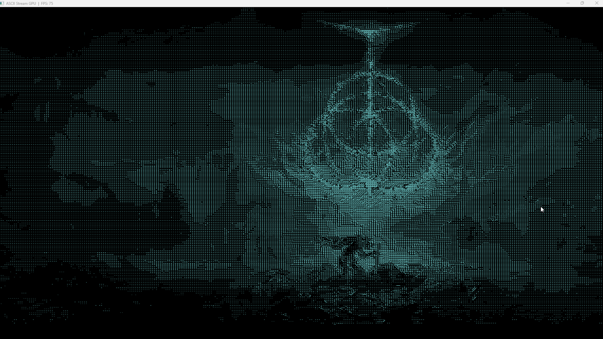

# ASCII Stream GPU

This project implements a real-time ASCII visualization of the desktop using GPU processing.

The application captures the screen, processes frames using CUDA, and renders the result via Direct3D 11. The goal was to explore low-latency graphics pipelines and interoperability between graphics and compute APIs.

## Demo

## Overview

The program captures the desktop in real time and transforms the image into an ASCII representation. Processing is performed entirely on the GPU without copying data back to the CPU.

The application also provides a simple control panel for enabling/disabling the effect and adjusting parameters.

## Pipeline

Screen Capture → D3D11 Texture → CUDA Processing → ASCII Mapping → Rendering

## Key components

- Real-time screen capture using Windows Graphics Capture
- GPU processing with CUDA
- Direct3D 11 rendering
- ASCII mapping based on brightness levels
- Optional edge-based enhancement
- Simple UI using ImGui

## Project structure

- `main.cpp` – application entry point
- `dx_context.*` – Direct3D initialization
- `screen_capture.*` – desktop capture
- `d3d_renderer.*` – rendering
- `ascii_kernel.cu` – CUDA processing
- `ascii_scale.h` – ASCII intensity mapping
- `ascii_edges.h` – edge glyphs
- `window.*` – window and UI handling

## Build

Requirements:
- Windows 10/11
- Visual Studio 2022
- CUDA Toolkit
- Windows SDK

Steps:
1. Clone the repository:
    git clone https://github.com/HubertBorzymek/ascii_stream_gpu.git

2. Open the solution in Visual Studio
3. Build in x64 configuration

## Usage

- Run the application
- Select a capture source
- Enable the ASCII effect
- Adjust parameters in the control panel

## Notes

The project focuses on:
- real-time processing
- GPU interoperability (D3D11 + CUDA)
- avoiding CPU readback
- simple and controllable rendering pipeline

## Possible extensions

- additional visual effects
- improved edge detection
- performance optimization
- recording output